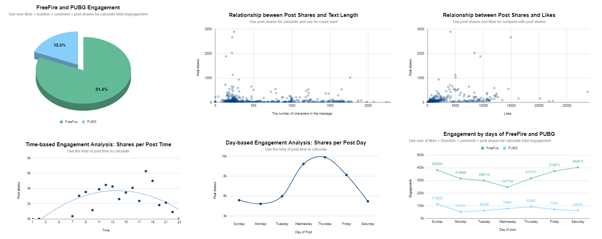
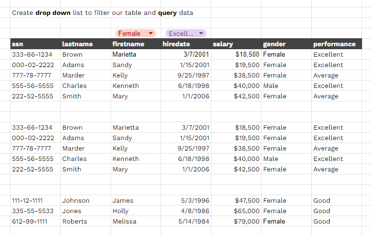
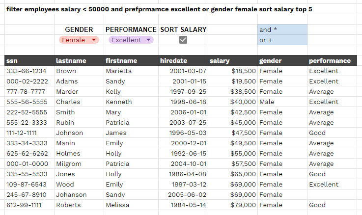
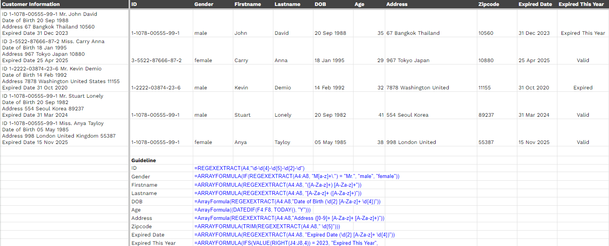
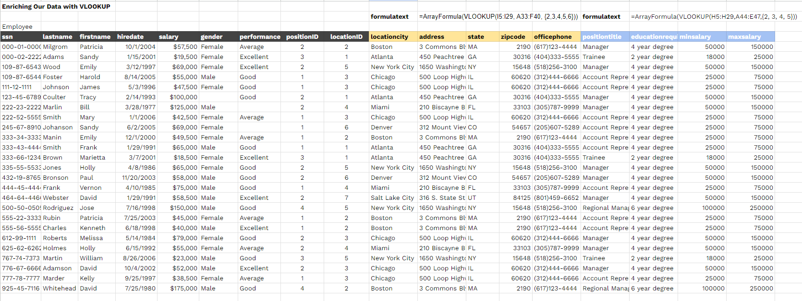
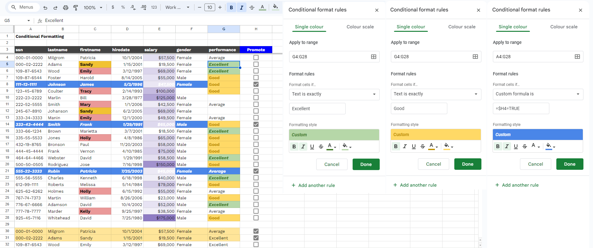
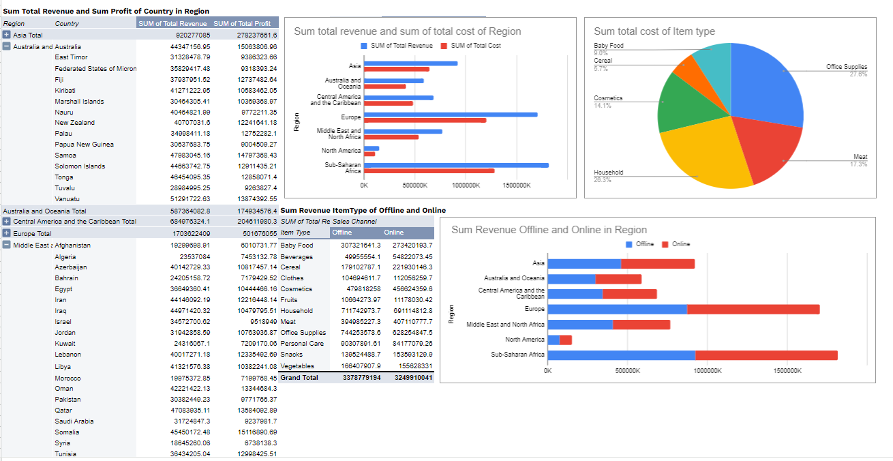

# Spreadsheets

I learned all about using Google Sheets from the Data Rockie Bootcamp. This cool course taught me everything from the basics to some really neat tricks!👍🏻✨

I work on mini projects like building a dashboard. So now I can use Google Sheets to solve real-life problems and show off what I learned in a cool way.✅

### Google Sheet skills:
[Course Google Sheets 101](https://docs.google.com/spreadsheets/d/1Y5zS4_hcxoVIVD7m1NRdUF6K9VTDql-A-CyRNqTTjRo/edit?usp=sharing)

[Query Google Sheets 101](https://docs.google.com/spreadsheets/d/1yXYKzM_dY3arXRgyjT_iIChIVufs5Dw5UqAuBL8kBZw/edit?usp=sharing)

[Advance google sheet skills](https://docs.google.com/spreadsheets/d/1JjZF3QjEvoGFdyXS4KiFxV4yzP6JmWGmV1wHmRjckAk/edit?usp=sharing)

### Project:
[Dashboard - Freefire vs. PubG](https://docs.google.com/spreadsheets/d/1ig26uNglr0LkIY3mbSkktGipCET7darkdJOvV25O1Hw/edit?usp=sharing)

### Mini Projects:
[Dynamic Query](https://docs.google.com/spreadsheets/d/1JjZF3QjEvoGFdyXS4KiFxV4yzP6JmWGmV1wHmRjckAk/edit#gid=1981431105)

[Dynamic Filter](https://docs.google.com/spreadsheets/d/1JjZF3QjEvoGFdyXS4KiFxV4yzP6JmWGmV1wHmRjckAk/edit#gid=151074853)

[ID Card Parser](https://docs.google.com/spreadsheets/d/1JjZF3QjEvoGFdyXS4KiFxV4yzP6JmWGmV1wHmRjckAk/edit#gid=2014543270)
using function =REGEXEXTRACT()

[VLOOKUP](https://docs.google.com/spreadsheets/d/1JjZF3QjEvoGFdyXS4KiFxV4yzP6JmWGmV1wHmRjckAk/edit#gid=927611170)

[Conditional Formatting](https://docs.google.com/spreadsheets/d/1JjZF3QjEvoGFdyXS4KiFxV4yzP6JmWGmV1wHmRjckAk/edit#gid=101149468)

[Pivot Table](https://docs.google.com/spreadsheets/d/1JjZF3QjEvoGFdyXS4KiFxV4yzP6JmWGmV1wHmRjckAk/edit#gid=191755251)

